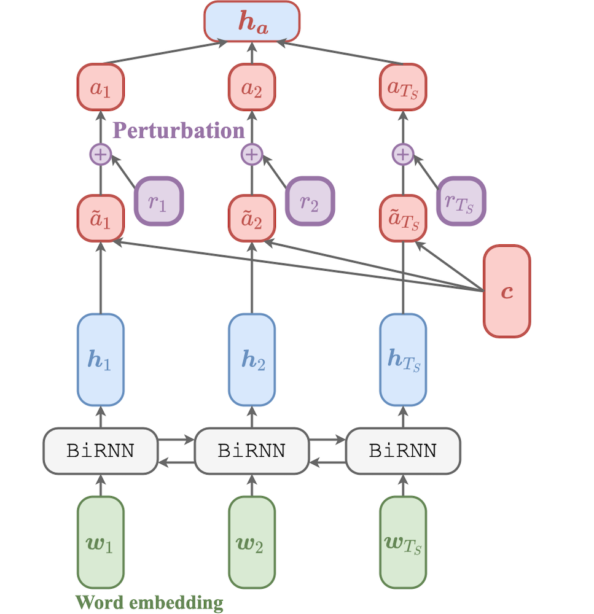
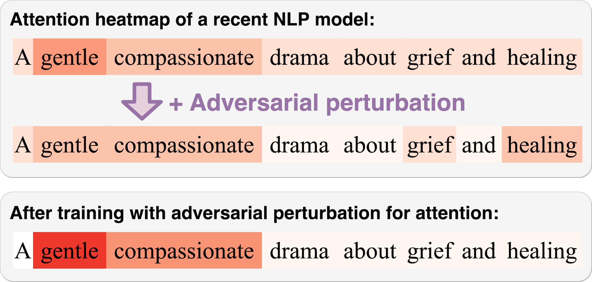

# Attention Meets Perturbations: Robust and Interpretable Attention with Adversarial Training

[](http://arxiv.org/abs/2009.12064)
[](https://doi.org/10.1109/ACCESS.2021.3093456)
[](https://github.com/shunk031/attention-meets-perturbation/actions/workflows/gh-pages.yml)

|                                        |                                           |
|----------------------------------------|-------------------------------------------|
| |  |

**Attention Meets Perturbations: Robust and Interpretable Attention with Adversarial Training**  
Shunsuke Kitada and Hitoshi Iyatomi

- Preprint: https://arxiv.org/abs/2009.12064
- Accepted for publication in the [IEEE Access](https://doi.org/10.1109/ACCESS.2021.3093456).

Abstract: *Although attention mechanisms have been applied to a variety of deep learning models and have been shown to improve the prediction performance, it has been reported to be vulnerable to perturbations to the mechanism. To overcome the vulnerability to perturbations in the mechanism, we are inspired by adversarial training (AT), which is a powerful regularization technique for enhancing the robustness of the models. In this paper, we propose a general training technique for natural language processing tasks, including AT for attention (Attention AT) and more interpretable AT for attention (Attention iAT). The proposed techniques improved the prediction performance and the model interpretability by exploiting the mechanisms with AT. In particular, Attention iAT boosts those advantages by introducing adversarial perturbation, which enhances the difference in the attention of the sentences. Evaluation experiments with ten open datasets revealed that AT for attention mechanisms, especially Attention iAT, demonstrated (1) the best performance in nine out of ten tasks and (2) more interpretable attention (i.e., the resulting attention correlated more strongly with gradient-based word importance) for all tasks. Additionally, the proposed techniques are (3) much less dependent on perturbation size in AT.*

## Install and Run the experiments


[](https://github.com/psf/black)
[](https://github.com/allenai/allennlp)

### Install requirements

```shell
pip install -U pip poetry setuptools
poetry install
```

### Prepare for spaCy

```shell
python -m spacy download en
```

### Prepare dataset for the experiments

- for all dataset

```shell
allennlp make-dataset all
```

- for specific dataset (e.g., SST)

```shell
allennlp make-dataset sst
```

### Run training models

<details>
  <summary>for binary classification (BC) tasks</summary>

```shell
# for SST
CUDA_VISIBLE_DEVICES=0 GPU=0 allennlp train \
    config/sst/train.jsonnet \
    -s output/sst/weighted

# for Newsgroups
CUDA_VISIBLE_DEVICES=0 GPU=0 allennlp train \
    config/newsgroups/train.jsonnet \
    -s output/newsgroups/weighted

# for IMDB
CUDA_VISIBLE_DEVICES=0 GPU=0 allennlp train \
    config/imdb/train.jsonnet \
    -s output/imdb/weighted

# for AGNews
CUDA_VISIBLE_DEVICES=0 GPU=0 allennlp train \
    config/ag_news/train.jsonnet \
    -s output/ag_news/weighted
```
</details>

<details>
  <summary>for question answering (QA) tasks</summary>

```shell
# For CNN
CUDA_VISIBLE_DEVICES=0 GPU=0 allennlp train \
    config/cnn/train.jsonnet \
    -s output/cnn/vanilla
```
</details>

<details>
  <summary>for natural language inference (NLI) tasks</summary>

```shell
# For SNLI
$ CUDA_VISIBLE_DEVICES=9 GPU=0 allennlp train \
    config/snli/train.jsonnet \
    -s output/snli/vanilla
```
</details>

## Citation

```bibtex
@article{kitada2020attention,
  title   = {Attention Meets Perturbations: Robust and Interpretable Attention with Adversarial Training},
  author  = {Shunsuke Kitada and Hitoshi Iyatomi},
  journal = {IEEE Access},
  year={2021},
  volume={9},
  number={},
  pages={92974-92985},
  doi={10.1109/ACCESS.2021.3093456}
}
```

## Reference

- S. Kitada and H. Iyatomi, "Attention Meets Perturbations: Robust and Interpretable Attention With Adversarial Training," in *IEEE Access*, vol. 9, pp. 92974-92985, 2021, doi: [10.1109/ACCESS.2021.3093456](https://doi.org/10.1109/ACCESS.2021.3093456).
